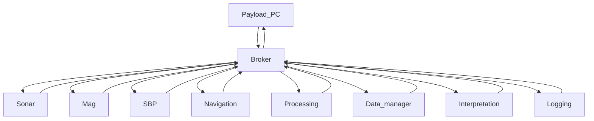
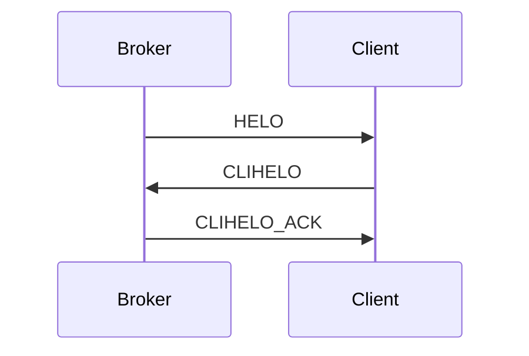

# Open Workflow Automation Protocol (OWAP)


## Abstract

This document describes a protocol for the automation of data collection and processing workflows for marine geological surveys. 

It provides a standardized way for open source, internal, and commercial software applications to share information about events that happen during normal operations (e.g. a file is ready for processing) allowing each application to react accordingly.

A typical use case is the automation of processing workflows on board of autonomous vehicles, where there can not be a human operator controlling the post-processing software tools.

The proposed protocol implements a simple Publish / Subscribe messaging queue architecture. Each client can publish events and receive events notifications for the topics it has subscribed.

## Status of this document

This document is not an Internet Standard and it is currently a DRAFT document. It is published for informational purposes.

Information about the current status of this document, any errata, and how to provide feedback on it may be obtained at: http://www.mogasw.com/owap

## Copyright notice

Copyright (c) 2023 Moga Software s.r.l. and all the people identified as the document authors. All rights reserved.

## Table of contents
	1. Introduction  
		1.1 Background  
		1.2 A simple use case  
		1.3 Additional benefits
	2. Protocol Overview
		2.1 TCP port
		2.2 Security model
	3. Frame format
		3.1 Why JSON
	4. Standard frames
		4.1 HELO
		4.2 CLIHELO
		4.3 CLIHELO_ACK
		4.4 HB
		4.5 SUB
		4.6 SUB_ACK
		4.7 UNSUB
		4.8 UNSUB_ACK
		4.9 EVENT
	5. Opening Handshake
	6. Heartbeat
	7. Subscribing and Unsubscribing
	8. Publishing
	9. Standard topics and events
		9.1 Recording
			9.1.1 Start of line
			9.1.2 End of line
		9.2 Processing
			9.2.1 Processing started
			9.2.2 Processing completed
			9.2.3 Processing error
		9.3 Interpretation
			9.3.1 Target detected
		9.4 Positioning
			9.4.1 Position and time sync
		9.5 Survey planning
			9.5.1 Line added / edited
			9.5.2 Line removed
		9.6 System status
			9.6.1 Application timeout
            9.6.2 Network status
		9.7 Logging
			9.7.1 Log message
		9.8 Broadcast (*)
			9.8.1 General message
            9.8.2 General request
            9.8.3 General response


## 1. Introduction

### 1.1 Background

Several specialized software tools are typically used for data collection, quality control (hence referred to as QC), post-processing, and data interpretation for marine geological surveys.

While many of these tools offer some level of automation (e.g. be able to monitor a folder for new files, and process them automatically), there is not, in general, an easy way to implement complex workflows, leaving this responsibility to human operators.

Traditionally, such surveys have been performed by properly equipped research vessels, with qualified onboard personnel specifically trained to carry on preliminary processing workflows. 

With the advent of autonomous vehicles (AUV/USV) it is not possible to rely solely on human interaction anymore, as an high bandwidth communication channel between the vehicle and the control station is usually not available. 
This implies some preliminary processing can only be performed on the support vessel, once the data collected from the autonomous vehicle have been recovered.

With the proposed Open Workflow Automation Protocol (hence referred to as OWAP), processing workflows can be implemented directly on the autonomous vehicle, to allow quicker turnaround during missions.



### 1.2 A simple use case

Let's consider a simple side-scan sonar survey workflow. The software tools involved are:

* The data collection software, which writes the raw sonar data to file;
* The navigation software, which provides positioning information to the data collection software;
* The sonar post-processing / mosaicking software, which can produce a geo-referenced image from the raw sonar data;
* The positioning post-processing software, which can produce high precision positioning data for better accuracy;

In this scenario the navigation software is directly interfaced with the data collection software. Once a file is completed, the post-processing / mosaicking software has to load the file, run its processing sequence and produce its output. Later on, the positioning post-processing software will produce its high precision solution (typically 30 min to 1 hour later). Once this positioning solution is ready, the sonar post-processing software must load it, update the dataset and produce new output.

This data flow is carried on by exchanging data files and interacting manually with each software application. 

With OWAP both the data collection software and the positioning post-processing software could send an event when a new file is ready; the sonar post-processing software could react to those events to update its output. The whole workflow is automated.

More software tools could be added to implement even more complex workflows. For example, a custom tool for automatic sonar targets identification could run automatically when a new mosaic image is produced; a custom data compression and upload tool could react automatically whenever new files are produced.

### 1.3 Additional benefits

An additional benefit of a centralized messaging queue is the opportunity to collect logs for any event notified through the system in a single place, instead of relying on the logging capabilities of each software tool.

## 2. Protocol Overview

The proposed protocol implements a simple Publish / Subscribe messaging queue architecture. 

A server process, the broker, accepts incoming connections from client applications. Each client publishes its own messages and receives those issued by other clients on the topics it subscribed to, through the broker.

The broker does not queue data off-channel. This means, a client that connects to the broker at a later stage, will not receive any event that was published when it was not connected.

### 2.1 TCP port

The broker process listens by default on localhost, port 9070/tcp. However, both the listen address and the TCP port should be configurable by the end user, in case the TCP port is already used by other services installed on the same machine, or a more complex IP configuration is required.

### 2.2 Security model

This protocol is intended as an IPC (Inter Process Communication) mechanism for processes running on the same machine (typically, the payload computer of an autonomous vehicle). The broker implementation should not increase the attack surface of the system. However, it is assumed that any process running on the target machine was rightfully installed. Therefore OWAP does not implement an authentication scheme, nor a frame encryption scheme. 

## 3. Frame format

All OWAP frames are encoded as JSON objects, and therefore, each frame starts with the character '{' and terminate with the characters sequence '}\r\n' (bracket, carriage return, new line). Empty, non-printable characters inside a frame such as whitespaces, new line, carriage return, tab, etc, sent between one frame and another are accepted but not required.

The character encoding to use is UTF-8.

The maximum frame size is set to 8 KB.

A client implementing OWAP should be able to parse both the human readable and the "minified" (all spaces removed) version of the JSON format. 

Most of the fields in an OWAP frame are character strings. One notable exception is the timestamp field (ts), which is encoded as a json numerical and should be interpreted as an unsigned long integer (8 bytes), as it is a Unix timestamp (milliseconds passed since 1 Jan 1970 00:00 UTC).

Filesystem paths are encoded as strings following the local OS convention. That is, paths on Windows will have the drive letter, comma and double backslash to separate filesystem levels (the double backslash is required to escape the backslash symbol inside a JSON string); Unix/Linux paths will start with a slash and use slash to separate filesystem levels.
In both cases, paths should always be absolute.

A few fields are common to all OWAP frames:

* type: a string which identify the frame type
* ts: the current system date and time of the sender, encoded as a Unix timestamp;
* flags (optional) : currently not used;

For example, an heartbeat frame (see below) is encoded as follows:

```json
{
	"type": "HB",
	"ts":1678189339596
}
```

Note while the type field is a string, the ts field is numeric. Strings in OWAP are case sensitive.

All the frame fields described in the following sections are intended as mandatory, unless otherwise specified, with "(optional)".

### 3.1 Why JSON

OWAP is intended to be used as a signaling protocol for events that happen infrequently (once every few seconds at max). Since throughput and latency are not a concern, a human readable encoding may be preferable against a custom binary format. 

JSON is human readable, allowing for easier debugging, and well supported on all modern programming languages, either natively or through open source libraries. Numerical values are encoded in a way that is independent from the machine architecture, and no special padding or byte alignment of the frame structure is required.

Moreover, JSON encoding allows for future expansions of the protocol without breaking backwards compatibility. Any extra field added to a frame would simply be ignored by older implementations, without causing parsing issues.

OWAP frames are usually less than 1 KB, even when not minified. Should latency and throughput become a concern in the future, a revision of the protocol may introduce frame level compression as well as mandate the use of low latency TCP connections (by disabling Nagle's algorithm).

## 4. Protocol frames

### 4.1 HELO

The HELO frame is sent by the broker to a newly connected client. It is the first frame of the opening handshake scheme described in section 5.

It adds two fields to the basic frame format:

* protocolVersion: currently "1.0";
* brokerName: a string which identify the broker implementation;

Example:

```json
{
	"type": "HELO",
	"ts":1678189339596,
	"protocolVersion": "1.0",
	"brokerName": "Moga OWAP Broker"
}
```

### 4.2 CLIHELO

The CLIHELO frame is sent by the client as a response to the HELO frame. It provides a name to identify the client, the confirm on the protocol version to use and optionally a comma separated list of topics this client wants to subscribe to.

The added fields are:

* protocolVersion: currently "1.0";
* clientName: a string which identify the client;
* topics (optional): a list of topics, as described in section 9;

Example:

```json
{
	"type": "CLIHELO",
	"ts":1678189339596,
	"protocolVersion": "1.0",
	"clientName": "SeaView",
	"topics": [ "acquisition", "processing" ]
}
```

### 4.3 CLIHELO_ACK

The CLIHELO_ACK frame is sent by the broker as a response to the CLIHELO frame. It confirms the protocol version to use and the topics the client has subscribed to.
The CLIHELO_ACK completes the handshake phase.

The added fields are:

* protocolVersion: currently "1.0";
* topics (optional): a list of topics, as described in section 9;

Example:

```json
{
	"type": "CLIHELO_ACK",
	"ts":1678189339596,
	"protocolVersion": "1.0",
	"topics": [ "acquisition", "processing" ]
}
```

### 4.4 HB

The HB (heartbeat) frame is sent by both the client and the broker at regular intervals, every two seconds. 

No fields are added to the basic frame format.

```json
{
	"type": "HB",
	"ts":1678189339596
}
```

### 4.5 SUB

The SUB (Subscribe) frame is sent by the client to subscribe to a standard topic, as listed in section 9.

It adds the field "topic" to the basic frame format.


```json
{
	"type": "SUB",
	"ts":1678189339596,
	"topic": "acquisition"
}
```

To acknowledge the subscription, the broker responds with the same SUB_ACK frame.

### 4.6 SUB_ACK

The SUB_ACK (Subscribe Acknowledge) frame is sent by the broker to acknowledge a client has subscribed to a certain standard topic, as listed in section 9.

It adds the field "topic" to the basic frame format.


```json
{
	"type": "SUB_ACK",
	"ts":1678189339596,
	"topic": "acquisition"
}
```

### 4.7 UNSUB

The UNSUB (Unsubscribe) frame is sent by the client to unsubscribe from a standard topic, as listed in section 9.

It adds the field "topic" to the basic frame format.


```json
{
	"type": "UNSUB",
	"ts":1678189339596,
	"topic": "acquisition"
}
```

To acknowledge the unsubscribe, the broker responds with the same SUB frame (updating the timestamp).

### 4.8 UNSUB_ACK

The UNSUB_ACK (Unsubscribe acknowledge) frame is sent by the broker to acknowledge a client has unsubscribed from a certain standard topic, as listed in section 9.

It adds the field "topic" to the basic frame format.


```json
{
	"type": "UNSUB_ACK",
	"ts":1678189339596,
	"topic": "acquisition"
}
```


### 4.9 EVENT

The EVENT frame is sent by the client to publish a standard event, as described in section 9.

The structure of the EVENT frame may vary depending on the specific event. However, some fields are common for all the event types. These common fields are:

* eventType: the event type identifier string, as described in section 9;
* topic: the event topic;

When the broker broadcasts a received event frame to the clients which have subscribed that topic, it also adds the issuer name:

* sender: the name of the client which published the event, as sent during handshake;

For example, a subscriber may receive from the broker a frame like the following:


```json
{
	"type": "EVENT",
	"ts":1678189339596,
	"topic": "recording",
    "eventType": "LINE_START",
    "lineName": "JD200_XLINE_SEC01_CLINAME_0001",
    "sender": "Nav software 1.0",
}
```

## 5. Opening Handshake

When a client connects to a broker, the broker sends an HELO frame and waits for the reply. The client replies with a CLIHELO frame, indicating its name, supported protocol version and, optionally, subscribed topics. Both HELO and CLIHELO frames contain a protocolVersion field, allowing for protocol version negotiation. 

The broker responds to a CLIHELO frame with the CLIHELO_ACK frame, confirming the subscribed list of topics (if any) and the protocol version to use.



If the broker can not acknowledge the CLIHELO (e.g. if it is not possible to negotiate a protocol version both parties can use), the connection is terminated.

Please note that while CLIHELO and CLIHELO_ACK frames are usually sent as part of the initial handshake, it is possible to send them again after the connection is initiated.

## 6. Heartbeat

Both the client and the broker send HB (heartbeat) frames at regular time intervals (by default, every 2 seconds), to keep the channel active even when there is no actual data to transfer. Both ends must actively monitor the channel and close the connection if no activity is detected within a predefined time frame (by default, 5 seconds). After a disconnection, clients should attempt to re-connect to the broker automatically. 

This scheme, which is widely used by application level protocols, is required to ensure the TCP connection is still active and both parties are running. 

If a client application crashes there is no TCP close handshake, hence, the OS (Operating System) will keep the TCP circuit open until OS level timeouts are reached. By implementing an application level timeout control the system can react quickly to such events. In general, OS level timeouts are much longer and so detecting a connection loss relying exclusively on them may require several minutes, or in some cases even hours. Using heartbeats, short timeouts and automatic reconnections, a connection loss can be recovered in a few seconds, minimizing data loss.

## 7. Subscribing and Unsubscribing

Clients will only receive events for the topics they subscribed. As stated in section 4, a client can subscribe to one or more topics by either including the list of topics in the CLIHELO frame, or by sending one or more SUB frames. Conversely, clients can also unsubscribe from a particular topic by sending an UNSUB frame to the broker. 

Regardless from the subscribed topic, each client will receive all the events issued in the broadcast ("*") topic.

##  8. Publishing

A client which want to publish an event must simply send an EVENT frame to the broker, as specified in section 4.9. The specific EVENT frame format depends on the eventType, as described in section 9.

## 9. Standard topics and events

### 9.1 Recording

* topic name: "recording"

Events issued with this topic report changes in the status of a recording system. Each recording system will issue their own events, depending on the current status. That is, if multiple systems are recording at the same time, the clients should expect multiple start and end of line events to be issued, one for each instrument.

#### 9.1.1 Start of line

The start of line event is issued when a new line is recorded. Depending on the instrument and the type of survey, the concept of survey lines may not be applicable. In this cases, the stat of line event is issued whenever recording starts.

The event specific fields are:

* eventType: always "LINE_START"
* lineName: the name of the dataset or line being recorded
* instrument: the name of the recording instrument
* dataFormat: logging data format
* filePath: full local path of the recorded data

Example:

```json
{
	"type": "EVENT",
	"ts":1678189339596,
	"topic": "recording",
    "eventType": "LINE_START",
    "lineName": "JD200_XLINE_SEC01_CLINAME_0001",
	"instrument": "Side-scan sonar model XYZ",
	"dataFormat": "XTF",
	"filePath": "Z:\\data\\xtfs\\JD200_XLINE_SEC01_CLINAME_0001.xtf",
    "sender": "SSS software 1.0",
}
```

#### 9.1.2 End of line

The end of line event is issued whenever recording is stopped.

The event specific fields are:

* eventType: always "LINE_END"
* lineName: the name of the dataset or line being recorded
* instrument: the name of the recording instrument
* dataFormat: logging data format
* filePaths: array with the full local paths of the files recorded. This array contains multiple elements if data files are split into multiple parts during recording

Example:

```json
{
	"type": "EVENT",
	"ts":1678189339596,
	"topic": "recording",
    "eventType": "LINE_END",
    "lineName": "JD200_XLINE_SEC01_CLINAME_0001",
	"instrument": "Side-scan sonar model XYZ",
	"dataFormat": "XTF",
	"filePaths": ["Z:\\data\\xtfs\\JD200_XLINE_SEC01_CLINAME_0001.xtf", "Z:\\data\\xtfs\\JD200_XLINE_SEC01_CLINAME_0001.0001.xtf" ],
    "sender": "SSS software 1.0",
}
```

### 9.2 Processing

* topic name: "processing"

Processing events report changes in the status of a data processing task. In OWAP a processing task is defined as any computation carried on by an application or a subsystem that can output its results to disk. For example, creating a mosaic image from backscatter datasets is considered a processing task.

#### 9.2.1 Processing started

This event is issued when a new processing task starts.

The event specific fields are:

* eventType: always "PROC_START"
* guid: a global identifier, created by the entity carring on the processing task, encoded as a GUID string without braces
* taskName: a string describing the task (optional)

Example:

```json
{
	"type": "EVENT",
	"ts":1678189339596,
	"topic": "processing",
    "eventType": "PROC_START",
    "guid": "ca928f1c-442e-4f20-9d33-86610de44d92",
	"taskName": "mosaicking",
    "sender": "SSS software 1.0",
}
```

#### 9.2.2 Processing completed

This event is issued when a processing task is completed.

The event specific fields are:

* eventType: always "PROC_END"
* guid: a global identifier, created by the entity carring on the processing task, encoded as a GUID string without braces
* filePaths: array with the full local paths of the output files produced by the task (optional)
* logFilePath: full local path of the log file produced by the processing software (optional)

Example:

```json
{
	"type": "EVENT",
	"ts":1678189339596,
	"topic": "processing",
    "eventType": "PROC_END",
    "guid": "ca928f1c-442e-4f20-9d33-86610de44d92",
	"filePaths": ["Z:\\data\\tiffs\\JD200_XLINE_SEC01_CLINAME_0001.tif", "Z:\\data\\tiffs\\JD200_XLINE_SEC01_CLINAME_0001.0001.tif" ],
	"logFilePath": "Z:\\data\\tiffs\\export_ca928f1c.log",
    "sender": "SSS software 1.0",
}
```

### 9.2.3 Processing error

This event is issued when a processing task is interrupted or terminates with an error.

The event specific fields are:

* eventType: always "PROC_ERROR"
* guid: a global identifier, created by the entity carring on the processing task, encoded as a string without braces
* errorMessage: a message explaining the failure reason (optional)
* logFilePath: full local path of the log file produced by the processing software (optional)

Example:

```json
{
	"type": "EVENT",
	"ts":1678189339596,
	"topic": "processing",
    "eventType": "PROC_ERROR",
    "guid": "ca928f1c-442e-4f20-9d33-86610de44d92",
	"errorMessage": "Not enough space on the destination drive to write the output file.",
	"logFilePath": "Z:\\data\\tiffs\\export_ca928f1c.log",
    "sender": "SSS software 1.0",
}
```

### 9.3 Interpretation

* topic name: "interpretation"

Interpretation events are issued when either a human operator or an automatic procedure successfully identify a feature in the recorded data.

#### 9.3.1 Target detected

This event is issued when a target is detected.

The event specific fields are:

* eventType: always "TARGET"
* targetType: a string identifying the type of target (e.g. "sonar contact", "mag anomaly")
* targetName: the name of the target
* sourceDataset: the name of the dataset where the target has been identified (optional)
* geometry: a WKT representation of the geometry of this target (optional)
* projection: the coordinate reference system used by geometry, as WKT (optional)

Note: WKT data in geometry and projection fields must be properly escaped to be encoded as a JSON string.

Example:

```json
{
	"type": "EVENT",
	"ts":1678189339596,
	"topic": "interpretation",
    "eventType": "TARGET",
	"targetType": "sonar contact",
	"targetName": "CONTACT_00001",
	"sourceDataset": "JD200_XLINE_SEC01_CLINAME_0001.xtf",
	"geometry" : "POINT (13.12345678 38.123423342)",
	"projection": "GEOGCS[\"WGS 84\",DATUM[\"WGS_1984\",SPHEROID[\"WGS 84\",6378137,298.257223563,AUTHORITY[\"EPSG\",\"7030\"]],AUTHORITY[\"EPSG\",\"6326\"]],PRIMEM[\"Greenwich\",0,AUTHORITY[\"EPSG\",\"8901\"]],UNIT[\"degree\",0.0174532925199433,AUTHORITY[\"EPSG\",\"9122\"]],AUTHORITY[\"EPSG\",\"4326\"]]",
    "sender": "SSS software 1.0",
}
```

### 9.4 Positioning

* topic name: "positioning"

Positioning events are issued when the status of the positioning system changes or to simply broadcast a new positioning and time synchronization message. While it is recommended to implement syncrhonization between different systems using low latency hardware means (e.g. GPS pps), the navigation system may issue a sync event from time to time to notify to other applications the current position and time of the vessel.

#### 9.4.1 Position and time sync

This event may be issued by the navigation system at regular but distant time intervals (> 1 second).

The event specific fields are:

* eventType: always "POS_UPDATE"
* X: the x coordinate component. Its unit is defined as part of the projection WKT description
* Y: the y coordinate component. Its unit is defined as part of the projection WKT description
* Z: the y coordinate component. Its unit is defined as part of the vertical datum node of the projection WKT description (optional)
* heading: the current heading in degrees (0° = North) (optional)
* speed: the current speed in knots (optional)
* fixNumber: fix number of the positioning solution (optional)
* time: the Unix timestamp, referred to UTC, when the positioning solution was computed
* projection: the coordinate reference system, as WKT (optional). 

If the projection field is not present, X and Y are assumed respectively as longitude and latitude referred to WGS84, expressed as decimal degrees, while Z is assumed to be an altitude in meters (positive above 0, negative below 0) referred to the WGS84 ellipsoid.

Note: WKT data in the projection field must be properly escaped to be encoded as a JSON string.

Example:

```json
{
	"type": "EVENT",
	"ts":1678189339596,
	"topic": "positioning",
    "X": 13.12345678,
	"Y": 38.123423342,
	"Z": -15.3,
	"heading": 44.2,
	"speed": 5.2,
	"fixNumber": 1234567,
	"time": 1678189339325,
	"projection": "GEOGCS[\"WGS 84\",DATUM[\"WGS_1984\",SPHEROID[\"WGS 84\",6378137,298.257223563,AUTHORITY[\"EPSG\",\"7030\"]],AUTHORITY[\"EPSG\",\"6326\"]],PRIMEM[\"Greenwich\",0,AUTHORITY[\"EPSG\",\"8901\"]],UNIT[\"degree\",0.0174532925199433,AUTHORITY[\"EPSG\",\"9122\"]],AUTHORITY[\"EPSG\",\"4326\"]]",
    "sender": "POS software 1.0",
}
```

### 9.5 Survey planning

* topic name: "surveyplan"

Survey planning events are issued when the survey plan changes (when survey lines are added, edited or removed).

#### 9.5.1 Line added / edited

This event is issued when a line is added to the survey plan, or an existing line is edited.

The event specific fields are:

* eventType: always "LINE_EDIT"
* lineName: the line name
* geometry: a WKT representation of the geometry of the line. Most of the times this would be a straight line, so a LINESTRING with two points would suffice. However, supporting any WKT geometry primitive allows to define polylines as well
* projection: the coordinate reference system used by geometry, as WKT

Example:

```json
{
	"type": "EVENT",
	"ts":1678189339596,
	"topic": "surveyplan",
    "eventType": "LINE_EDIT",
	"lineName": "JD200_XLINE_SEC01_CLINAME_0001",
    "geometry" : "LINESTRING (13.12345678 38.123423342, 13.123487654 38.12348989)",
	"projection": "GEOGCS[\"WGS 84\",DATUM[\"WGS_1984\",SPHEROID[\"WGS 84\",6378137,298.257223563,AUTHORITY[\"EPSG\",\"7030\"]],AUTHORITY[\"EPSG\",\"6326\"]],PRIMEM[\"Greenwich\",0,AUTHORITY[\"EPSG\",\"8901\"]],UNIT[\"degree\",0.0174532925199433,AUTHORITY[\"EPSG\",\"9122\"]],AUTHORITY[\"EPSG\",\"4326\"]]",    
	"sender": "POS software 1.0"
}
```

#### 9.5.2 Line removed

This event is issued when a line is removed from the survey plan.

The event specific fields are:

* eventType: always "LINE_REMOVED"
* lineName: the line name

Example:

```json
{
	"type": "EVENT",
	"ts":1678189339596,
	"topic": "surveyplan",
    "eventType": "LINE_REMOVED",
	"lineName": "JD200_XLINE_SEC01_CLINAME_0001", 
	"sender": "POS software 1.0"
}
```

### 9.6 System status

* topic name: "system"

System status events inform clients about the overall status of the system. 

#### 9.6.1 Application timeout

This event is issued directly by the broker when a client is disconnected for inactivity.

The event specific fields are:

* eventType: always "APP_TIMEOUT"
* clientName: the name of the client which has timed out

Example:

```json
{
	"type": "EVENT",
	"ts":1678189339596,
	"topic": "system",
    "eventType": "APP_TIMEOUT",
    "clientName": "SSS software 1.0",
	"sender": "OWAP Broker - reference impl. - 1.0"
}
```

#### 9.6.2 Network status

This event is issued when the status of an external network connection changes. An external network connection could be an Internet connection or a direct connection between a vehichle and a support vessel. Such connection could be used to upload data automatically when it becomes available.

The event specific fields are:

* eventType: always "NETWORK_STATUS"
* status: "connecting", "online" or "offline" depending on the connection status

Example:

```json
{
	"type": "EVENT",
	"ts":1678189339596,
	"topic": "system",
    "eventType": "NETWORK_STATUS",
    "status": "online",
	"sender": "Payload computer - 1.0"
}
```

### 9.7 Logging

* topic name: "logging"

Logging events are generic events containing a text message that should be part of a general system log.

#### 9.7.1 Log message

This event is issued by any application which need to write a message to the general system log.

The event specific fields are:

* eventType: always "LOG"
* message: the message to add to the system log

Example:

```json
{
	"type": "EVENT",
	"ts":1678189339596,
	"topic": "logging",
    "eventType": "LOG",
    "message": "This is a message for our log file.",
    "sender": "SSS software 1.0",
}
```

### 9.8 Broadcast (*)

* topic name: "*"

Broadcast events are sent to each client, regardless from their subscriptions. They can be used to broadcast a generic message or post a generic request / response.

#### 9.8.1 General message	

The general message broadcast event can be issued by any client to inform all the others about any non-specific event.

The event specific fields are:

* eventType: always "GENERIC"
* message: the message to add to the system log

Example:

```json
{
	"type": "EVENT",
	"ts":1678189339596,
	"topic": "*",
    "eventType": "GENERIC",
    "message": "This is a message for you all: the cake is a lie!"
}
```

#### 9.8.2 General request

This general request can be used by an application to request data or send commands to another client. If a client can handle the request, it should reply by issuing a general response event. Please note these events are still broadcasted to all clients. They should be considered as a last resort to let two or more clients exchange data outside of what is already provisioned by OWAP.

The event specific fields are:

* eventType: always "GEN_REQ"
* guid: a global identifier to distinguish between multiple general requests
* params: parameters describing the request

Example:

```json
{
	"type": "EVENT",
	"ts":1678189339596,
	"topic": "*",
    "eventType": "GEN_REQ",
	"guid": "ca928f1c-442e-4f20-9d33-86610de44d92",
    "params": "sh ls -l /data"
}
```

#### 9.8.3 General response

This general response is issued by a client which can handle a generic request issued earlier.

The event specific fields are:

* eventType: always "GEN_RESP"
* guid: a global identifier to distinguish between multiple general requests
* result: a string containing the actual response

Note: the result string must be properly escaped to be encoded in a JSON string.

Example:

```json
{
	"type": "EVENT",
	"ts":1678189339596,
	"topic": "*",
    "eventType": "GEN_RESP",
	"guid": "ca928f1c-442e-4f20-9d33-86610de44d92",
    "response": "total 0"
}
```

Author's Addresses
------------------

* Sergio Monteleone - e-mail: owap@mogasw.com